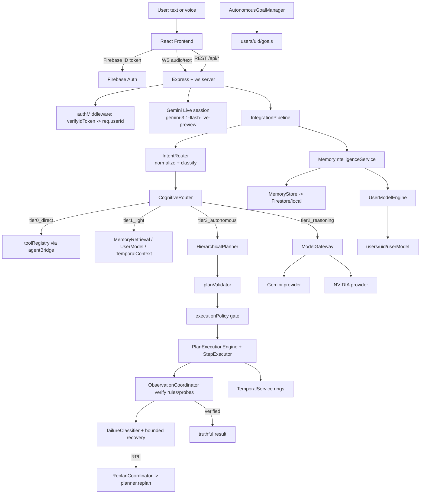
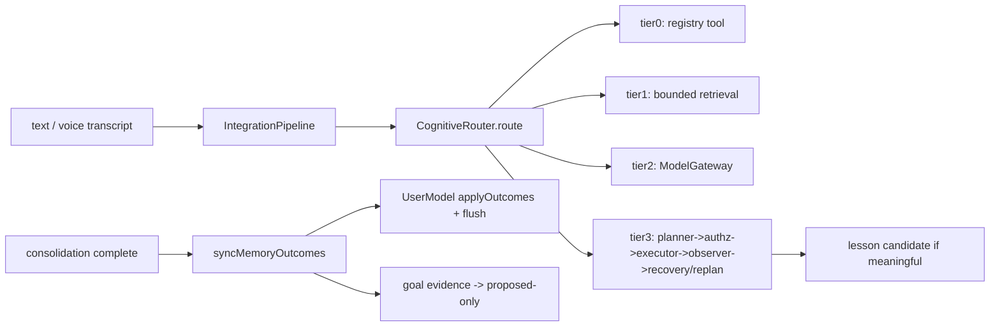
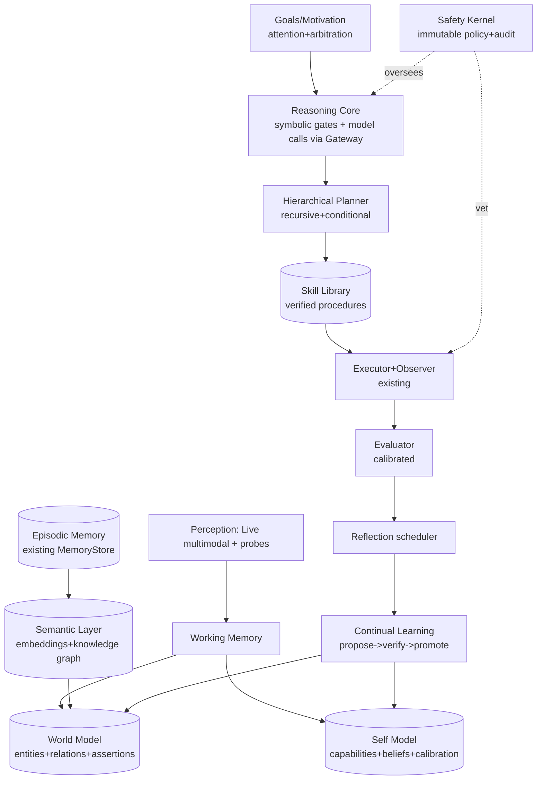

# LOHZ — Master Project Context

> **Document purpose:** single source of truth describing what LOHZ *is*, what is actually
> implemented, how the pieces connect, where the honest boundaries are, and what separates
> the current engineering from any long-term general-intelligence research direction.
>
> **Verification basis:** every claim below was checked against repository source code at
> documentation time. Test count was re-measured during documentation (`vitest run`):
> **46 files / 764 tests passing**. Where a historical phase report disagrees with current
> code, this document states the CURRENT state.
>
> **Status vocabulary used throughout:**
> `IMPLEMENTED` · `PARTIAL` · `EXPERIMENTAL` · `SCAFFOLDED` (interface/seam exists, no real
> logic behind it) · `DORMANT` (implemented + tested but not reachable in the live product
> path) · `NOT IMPLEMENTED` · `KNOWN LIMITATION` · `FUTURE IDEA`

---

## Table of Contents

1. [Project Identity](#1-project-identity)
2. [Tech Stack (verified)](#2-tech-stack)
3. [Repository Map](#3-repository-map)
4. [Architecture Overview](#4-architecture-overview)
5. [Authentication & Multi-User Isolation](#5-authentication--multi-user-isolation)
6. [Memory System](#6-memory-system)
7. [User Model](#7-user-model)
8. [Temporal System](#8-temporal-system)
9. [Goals & Motivation](#9-goals--motivation)
10. [Intent Router](#10-intent-router)
11. [Planning Engine](#11-planning-engine)
12. [Execution Engine](#12-execution-engine)
13. [Observation / Verification / Recovery](#13-observation--verification--recovery)
14. [Full-System Integration](#14-full-system-integration)
15. [Voice System](#15-voice-system)
16. [Windows Agent & Tools](#16-windows-agent--tools)
17. [Model Gateway & Model-Call Inventory](#17-model-gateway--model-call-inventory)
18. [Cognitive Loop / Unified Loop](#18-cognitive-loop--unified-loop)
19. [Reflection / Learning / Proactive Behavior](#19-reflection--learning--proactive-behavior)
20. [Security Audit Summary](#20-security-audit-summary)
21. [Testing](#21-testing)
22. [Performance (measured)](#22-performance)
23. [Current Limitations](#23-current-limitations)
24. [AGI Gap Analysis](#24-agi-gap-analysis)
25. [Architectural Self-Assessment Questions](#25-architectural-self-assessment)
26. [Proposed Future Architecture (for discussion)](#26-proposed-future-architecture)
27. [Roadmap Framing](#27-roadmap-framing)
28. [Final Status Tables](#28-final-status-tables)
29. [Final Verdicts](#29-final-verdicts)

---

## 1. Project Identity

**LOHZ** is a personal AI companion/assistant project (working name; inspired by
fictional assistants such as JARVIS). It runs locally: a React frontend talks to a
Node/Express + WebSocket backend which orchestrates Gemini models, a Windows desktop
agent for computer control, and a growing set of cognitive subsystems (memory, user
model, temporal reasoning, goals, planning, execution, verification).

### Intended long-term vision

Natural voice interaction · persistent per-user identity and memory · understanding of
ongoing projects and goals · temporal continuity ("what was I working on?") · context
awareness · reasoning · hierarchical planning · safe computer/tool use · observation and
verification of outcomes · recovery from failure · reflection and learning · proactive
(but gated) assistance · deep personalization · multimodal input · and, as a *research
direction*, increasingly general autonomous behavior.

### Critical framing

LOHZ today is an **engineering artifact**: an advanced, well-tested, cost-aware personal
assistant framework with genuinely implemented perception→action→verification loops for
*bounded* tasks. It is **not AGI**, not close to AGI, and none of its components claim
general intelligence. Section 24 separates:

- **Current engineering capabilities** — concrete, testable behaviors shipped today.
- **Long-term AGI research direction** — open problems this architecture may eventually
  contribute to, with no implied timeline or promise.

Any statement like "LOHZ understands X" in this document means *"the code implements a
deterministic or model-mediated approximation of X with measurable limits"*.

---

## 2. Tech Stack

Verified from `package.json`, lockfile, and source imports.

### Frontend
| Tech | Version | Evidence |
|---|---|---|
| React | ^19.0.1 | `package.json` |
| TypeScript | ~5.8.2 | `package.json` (`tsc --noEmit` gate) |
| Vite | ^6.2.3 | build script + `vite.config.ts` |
| Tailwind CSS | ^4.1.14 (via @tailwindcss/vite) | deps |
| Framer Motion (`motion`) | ^12.23.24 | deps |
| lucide-react | ^0.546.0 | deps |
| Firebase JS SDK | ^12.18.0 | auth only on client |

### Backend
| Tech | Version | Notes |
|---|---|---|
| Node + Express | ^4.21.2 | REST API |
| ws (WebSocket) | ^8.21.0 | client↔server proxying to Gemini Live |
| tsx | ^4.21.0 | dev runtime (`npm run dev`) |
| esbuild | ^0.25.0 | server bundle → `dist/server.cjs` |
| firebase-admin | ^14.3.0 | ID-token verification + Firestore (server-only) |
| dotenv | ^17.2.3 | env injection |

### AI
- `@google/genai` ^2.4.0 — Gemini SDK.
- **Gemini Live**: `gemini-3.1-flash-live-preview` (voice session, `server.ts:1040`).
- **Gemini text**: `gemini-3.5-flash` (memory consolidation, gateway default).
- **NVIDIA NIM adapter**: `meta/llama-3.1-8b-instruct` (`nvidiaAdapter.ts:24`).
- ModelGateway abstraction (Section 17).

### Desktop automation
- Separate **Windows agent** process (`windows-agent/*.ts`, run via `npm run agent`),
  connected to the server through an authenticated WebSocket bridge
  (`agentBridge.ts`). Playwright (^1.62.1) is used by a *separate* local browser-agent
  experiment (`local-agent.js`) — not part of the main tool registry.

### Persistence
Firestore (via admin SDK, per-user doc tree) with local-file/in-memory fallbacks at
every seam. Details per subsystem in Sections 6–13.

### Authentication
Firebase Auth (client), Firebase Admin ID-token verification (server), plus a separate
256-bit token scheme for the Windows-agent bridge.

---

## 3. Repository Map

Root files of interest: `server.ts` (~72 KB, HTTP+WS+Live orchestration),
`server_memory.ts` (consolidation entry), `agentBridge.ts`, `toolRouter.ts`,
`firestore.rules`, `.env.example`, `WINDOWS_AGENT.md`, `README.md` (AI Studio boilerplate,
low information), `local-agent.js` (browser-agent experiment), various `test_*.cjs`
manual smoke scripts.

`src/lib/` subsystem inventory (all folders contain implementation + colocated tests):

```
src/lib/
├── router/            Phase 27 intent classification + tier routing
├── planner/           Phase 28 hierarchical planning
├── execution/         Phase 29 authorized plan execution
├── observation/       Phase 30 observe/verify/recover/replan
├── integration/       Phase 31 pipeline composition + memory bridge
├── memoryIntelligence/Phase 23 extraction/scoring/dedupe/lifecycle
├── userModel/         Phase 24 persistent user model engine
├── temporal/          Phase 25 events/windows/sessions/context
├── goals/             Phase 26 autonomous goal manager
├── persistence/       Phase 22 FirestoreUserStore/MemoryStore seams
├── modelGateway/      provider abstraction + cost control
├── persistence        legacy-era: memoryRetrieval/memoryConsolidation/memoryTypes
├── cognitive core:    cognitiveLoop, unifiedLoop(+EventBus), cognitiveState,
│                      decisionEngine, situationEngine, interruptionControl,
│                      interactionIntelligence/modes, silenceAnalyzer,
│                      conversationQuality, sentiment, selfEvaluation,
│                      reflectionEngine, taskPlanner, toolDecisionEngine,
│                      proactiveSpeech, userPreferences
└── misc:              audio.ts (Live client), firebase.ts (auth-only),
                       atmosphere.ts, brainObservability.ts
```

Frontend: `src/App.tsx` (~1561 lines / ~73 KB monolith), components in `src/components/`
(TextInput, Settings, MemoryDashboard, BrowserAgent, TranscriptionPanel,
LohzCoreVisualizer, etc.), `src/hooks/useVoiceMemory.ts`.

---

## 4. Architecture Overview



Key structural facts (verified):

- The **CognitiveRouter owns tier selection**; nothing else re-classifies.
- **Gemini Live remains the conversational substrate.** Typed text reaches Live unless
  intercepted as a deterministic Tier-0 command (Section 14).
- The **UnifiedLoop/CognitiveLoop stack is NOT in the live request path.** It is a fully
  built, fully tested orchestration layer (perception→decision→act→reflect over an
  event bus) that the server does not instantiate today. This is the single largest
  dormant asset in the repo. See Section 18.
- Two planning modules exist with different scopes: `taskPlanner.ts` (used by
  UnifiedLoop's internal PLAN step) and `planner/HierarchicalPlanner` (Tier 3, live).
  They are not duplicates in responsibility, but this should be consolidated eventually.

---

## 5. Authentication & Multi-User Isolation

### Client → server
- Firebase Auth on the client (`src/lib/firebase.ts` — auth-only; no Firestore on the
  client). REST and WS requests carry a bearer ID token.
- `server/authMiddleware.ts`: `verifyIdToken` → `req.userId`. Fail modes:
  - missing/expired token → 401;
  - Admin SDK unconfigured → dev-open as `"default"` **unless** `LOHZ_REQUIRE_AUTH=1`,
    then 503 fail-closed.
- WS upgrade performs the same verification; invalid tokens destroy the socket
  (Phase 20 hardening).

### Server ↔ Windows Agent
- Separate trust domain: 256-bit token (`LOHZ_AGENT_TOKEN` env → `.agent-token` file →
  auto-generated on first run, shared by bridge and agent; timing-safe comparison;
  `bearerAuth` middleware returns 401/403).

### Per-UID isolation (enforced in code, covered by tests)

| Domain | Mechanism | Evidence |
|---|---|---|
| Memories | `metadata.userId` stamped on write; filtered on read; uid path validation | `persistence/*`, tests |
| Goals | manager APIs are uid-scoped; cross-uid transition → "goal not found" | `goals/manager.ts` |
| Plans | `Plan.userId` must equal executor identity else REJECTED | `execution/*` tests |
| Executions | records keyed `uid::requestId`; replay scoped | `execution/persistence.ts` |
| Temporal | store keyed per uid; A/B/C isolation tests | `temporal/*` tests |
| User model | bundles keyed by uid; foreign record reads refused | `firestoreUserStore.getModelBundle` |
| Observations | keyed `uid::requestId` | `observationStore` |

### Firestore security rules
`firestore.rules` — **AUTHORED, NOT DEPLOYED, NOT VERIFIED LIVE.** Rules enforce
`request.auth.uid == uid` per user subtree; there is no Firebase project configured in
this environment (no service account, no CLI), so deployment has never been attempted.
All Firestore access is Admin-SDK (server-side) which bypasses rules anyway; rules exist
for future direct-client access.

---

## 6. Memory System

Two generations exist side by side:

| Layer | Status | Location |
|---|---|---|
| Legacy regex consolidation (`memoryConsolidation.ts`) + `MemoryRetrieval` scoring | **DORMANT** (tested; superseded in live path) | `src/lib/` |
| Memory Intelligence pipeline (Phase 23) | **IMPLEMENTED, LIVE** via `processConversationSlice` pre-gate | `memoryIntelligence/*`, `server_memory.ts` |

### Live pipeline (conversation → durable memory)

1. **Deterministic pre-gate** (`server_memory.ts`): `extractCandidates()` classifies user
   turns; if nothing clears floors (importance ≥ 0.25, confidence ≥ 0.40) the LLM call is
   skipped entirely — chatter ("okay", "thanks") costs zero tokens.
2. **Extraction** (`extraction.ts`): closed pattern tables map utterances to kinds
   fact/preference/goal/project/behavior/event/correction/learning/procedure with
   importance breakdown (explicitness .30 / usefulness .25 / repetition .15 / stability
   .10 / goal-relevance .10 / recency .10) and confidence (base ± boosts/penalties).
3. **LLM transaction generation** — routed through **ModelGateway**
   (`capability:"memory_consolidation"`, userId+reason attribution, JSON schema). If the
   gateway throws (cost limit/provider down) → return null, **no partial writes**, source
   file untouched.
4. **Lifecycle decisions** (`dedupe.ts`, `resolution.ts`): sha1 token-set fingerprints →
   exact-dup short-circuit; Jaccard ≥0.80 near-dup → KEEP/reinforce (+confidence);
   polarity-flip contradiction → ARCHIVE-old + ADD-new with `supersedes` lineage;
   ambiguous band → conservative KEEP; IGNORE below floors; REMOVE only explicit, and
   even then evidence-bearing memories archive instead of delete.
5. **Persistence** through the Phase 22 `MemoryStore` seam:
   `LocalFileMemoryStore` (default/dev) or `FirestoreMemoryStore` → `users/{uid}/memories/{id}`.
   Full-list transactional save; uid re-stamped on write; save-failure ⇒
   `persistenceVerified:false` surfaced honestly.
6. **Migration**: `migrateLocalMemoryToFirestore()` — receipt-deduped
   (`users/{uid}/migrations/localMemoryV1`), uid re-stamping, read-back verification,
   source archived to `data/memories/.archive/` (never deleted). Boot-time migration runs
   when Firestore is healthy.
7. **Decay** (`decay.ts`): layer halflifes (user_model ∞ … working 30d); decay lowers
   score/confidence toward ARCHIVE — never deletes.

### Retrieval
`memoryRetrieval.ts` (legacy scorer) still backs UnifiedLoop tests; Phase 23 added
`memoryIntelligence/retrieval.ts` (semantic/importance/confidence/recency/goal-alignment
weighted, budget-capped). Live Tier 1 currently uses simple bounded filtering over stored
memories rather than the full scorer (see Known Limitations).

### What is deterministic vs LLM
Everything except step 3 (transaction generation) is pure code. The LLM never assigns
importance/confidence/kind directly to persisted metadata; those come from the
deterministic layer, and model output is schema-constrained transactions only.

### Limits
maxCandidatesPerSlice 10, maxMemoriesPerUser 500, maxWorkingMemories 20,
retrieval ≤10 results, consolidation lock prevents concurrent slices.

---

## 7. User Model

**IMPLEMENTED (engine + persistence + tests); conversation integration via ONE bridge.**

Schema (`userModel/types.ts`): `UserModelBundle { uid, schemaVersion, identity,
preferences (closed key namespace: responseLength/proactivity/style/availability/
notifications/general), projects[] (≤8, status active/paused/completed/archived),
interests[] (≤10), activeGoalIds[] (≤10), world: WorldState }`. Every attribute is an
`AttributedValue { value, confidence, state: confirmed|updated|uncertain|conflicted,
temporalStatus, source: explicit|derived|observed, updatedAt, evidenceMemoryIds≤5 }`.
Superseded preference values are kept in bounded `previous[]` (≤3) with reason — history
is never destroyed.

**Privacy denylist** (`PRIVACY_DENYLIST`): politics, religion, sexual orientation,
medical, race/ethnicity/citizenship patterns are refused outright at update time — no
derived profiling of protected characteristics.

**Integration status:** the ONLY automatic update path is
`IntegrationPipeline.syncMemoryOutcomes()` invoked after successful memory consolidation
(`server.ts` turn-complete handler) via `integration/memoryBridge.ts`
(`outcomesFromProcessResultLite`). There is no UI mutation endpoint (read-only
`GET /api/usermodel`). Persistence: debounced flush →
`users/{uid}/userModel/_root`; restart round-trip equality is tested.

WorldState inside the bundle tracks activity/activeProject/interactionMode/timeContext/
pendingTaskCount/recentEvents ring — updated through controlled `observeWorld` calls.

---

## 8. Temporal System

**IMPLEMENTED** (`temporal/*`, Phase 25) with additive Phase 26/29/30 event types.

- `TemporalEvent` — UTC epoch ms timestamps only; ID/type/userId/source/refs
  (memoryId/goalId/projectKey)/description(≤80)/confidence/importance/duration.
- Closed vocabulary (currently 29 types incl. goal lifecycle, plan lifecycle, verification
  and recovery events).
- Deterministic ordering (ts → id tiebreak), fingerprint dedupe, ring buffer ≤200 events,
  topics ≤12, snapshots ≤5.
- Relative-time ladder on UTC math: just_now <2m → minutes_ago <1h → hours_ago <12h →
  today/yesterday/this_week/last_week (UTC-day diff) → recent <30d → stale.
- Session continuity: first_visit / same_session(≤30min) / new_session(≤6h) /
  returning_user; absence tracking stores **only** lastInteractionAt +
  inactiveDurationMs — the system draws **no** inferences about why a user is absent.
- Change detection diffs two UserModelBundles into typed events (zero noise on identical
  bundles; first observation is baseline).
- CurrentContext builder produces bounded derived snapshots; continuityHint offers
  evidence-based "continue that topic" suggestions without assuming intent.
- Persistence: `users/{uid}/temporal/_root` via Phase 22 store pair; restart-equality and
  concurrency (120 parallel writes + dup suppression) tested.

**What LOHZ does NOT infer:** emotions, sleep/busy states, intent-from-silence, or any
state without a recorded timestamp/evidence.

---

## 9. Goals & Motivation

Two artifacts again:

| Artifact | Status |
|---|---|
| `goalSystem.ts` (in-memory Goal/Task CRUD used by UnifiedLoop tests) | **DORMANT** in live path |
| `goals/AutonomousGoalManager` (Phase 26) | **IMPLEMENTED**; constructed in server when Firestore healthy; fed by IntegrationPipeline evidence |

Authority ladder: `user(4) > explicit_request(3) > derived(2) > system(1)`.
Derived/system-sourced goals start as `proposed` with autonomyLevel ≤1 and can only be
promoted by `confirmProposal` from a user-authority context. State machine is closed
(`VALID_TRANSITIONS`); completed→active requires explicit `reopen()`. Priorities
critical/high/medium/low → bounded numeric; staleness decays priority (never boosts).
Dependencies form a DAG with DFS cycle rejection; hierarchy depth ≤3, children ≤8.
Attention score (priority .30/deadline .20/gap .15/user-relevance .15/freshness .10/
blocker .10) ranks what deserves attention — **it authorizes nothing**.
`evaluateGoals()` returns WAIT/MAINTAIN/PROPOSE/UPDATE/REQUEST_CLARIFICATION with zero
side effects. Duplicate titles collapse to reinforcement; opposite-polarity conflicts
mark `conflictWith` and force REQUEST_CLARIFICATION instead of resolution.

**What creates goals:** users (active immediately), explicit_request (active),
derived candidates from conversation evidence (**proposed only**, via
`proposeFromEvidence` — wired live through the IntegrationPipeline in Phase 31),
system maintenance (active, low authority).
**What executes actions:** nothing in the goal layer. Execution authority lives solely in
the Phase 29 policy gate.

---

## 10. Intent Router

`router/intentRouter.ts` + `normalize.ts` + `entities.ts` — **IMPLEMENTED, LIVE.**

- Normalization loop: wake prefixes ("hey lohz", "ok lohz:"), politeness
  ("can you please", "for me"), fillers ("um..."), punctuation/case — entities preserved.
- Entity extraction (bounded set): appName (19 known apps + capitalized-token fallback),
  url (full + bare-domain), volumeLevel (digits + word numbers, clamped), filePath,
  quoted clipboard payload, goalId/projectKey passthrough.
- Closed 21-intent vocabulary; pattern table, first-match wins; deterministic confidence
  (exactCommand .98, clearPattern .90, ambiguous .50–.80, chat fallback .55).
- Ambiguity gate: unresolved referents ("open it") or missing payloads force ASK with
  confidence <0.75 — pronouns can never become app names (explicitly hardened).
- Risk table per intent (safe…critical); Tier mapping: 10 device intents → tier0_direct;
  chat/memory_query/context_query → tier1_light; reason/explain/compare/summarize →
  tier2_reasoning; manage_goal/plan/execute_task (+goal-imperative catch-all placed AFTER
  execute_task so specific matches win) → tier3_autonomous.

**Why "Open Chrome" needs no LLM:** classification is pure regex over normalized text;
measured end-to-end routing latency ≈ **6 ms** with **0 model calls** (live smoke +
tests). Voice transcripts enter the same normalizer/classifier — parity is asserted by
test ("hey lohz um... can you open Spotify please?" === typed "open spotify").

---

## 11. Planning Engine

`planner/*` (Phase 28) — **IMPLEMENTED for draft→validated→ready.** Running/completed
step statuses exist in the schema but are unwritable by the planner.

- **Stage 1 deterministic decomposition**: objective split on "then/and then/;",
  segments classified by a local closed-vocabulary matcher mapped to registry tools with
  per-tool risk. Zero model calls. Chained commands like "open chrome, then take a
  screenshot" produce ordered dependency chains.
- **Stage 2 model-assisted**: only when stage 1 cannot express the request. Prompt
  includes allowed-tools list and context rendered inside explicit
  BEGIN/END_UNTRUSTED_CONTEXT_DATA fences. Output treated as UNTRUSTED: JSON extraction,
  50 KB cap, strict schema, unknown tool ⇒ whole-plan rejection, graph re-validation,
  budget `MAX_PLANNER_MODEL_CALLS=2`.
- Bounds: ≤20 steps, dep depth ≤10, branch width ≤5, retries ≤2, timeout ≤120 s,
  confidence gate 0.60 (below → clarification, stays draft).
- Danger gate: destructive phrasing ("delete all my files") → rejected, nothing persisted.
- Persistence: `PlanStore` seam (`InMemoryPlanStore` shipped; Firestore adapter follows
  the Phase 22 pattern — see Limitations).
- **Replan**: `planner.replan()` copies a failed plan to a new draft preserving
  uid/goalId/objective/version+1; Phase 30's ReplanCoordinator filters completed steps
  out and promotes via `promoteDraft` (same validate/gate machinery). Cap: 2 replans per
  requestId.

**Where planning stops:** the planner's output is a validated `ready` plan. It contains
no execution results, marks nothing running/completed, and grants no authority. All
authority transfer happens in Section 12's gate.

---

## 12. Execution Engine

`execution/*` (Phase 29) — **IMPLEMENTED.**

Pipeline: ownership check (plan.userId must equal authenticated uid) → idempotency
(replay by requestId; record saved BEFORE running so concurrent duplicates observe it) →
status gate (`ready` only) → **authorization policy** → per-plan worker lock → wave
scheduler (deps respected, parallelism ≤5) → StepExecutor per step → honest finalization.

Authorization (`policy.ts`): risk derived from the shared tool-risk table; safe/low +
autonomy≥1 → AUTHORIZED; medium/high → REQUIRES_CONFIRMATION (explicit server-captured
`confirmed` upgrades high only); destructive/critical → REJECTED always. Planner output
alone grants nothing.

StepExecutor fail-closed checks: catalog membership, destructive blocklist, strict
argument contracts (unknown keys rejected; URL scheme, volume range, path-traversal,
content caps), timeout clamp ≤120 s, retry bound ≤2 with transient-only codes and
never for medium/high-risk tools. Results are observed verbatim (JSON-truncated ≤2000
chars) — success is whatever the runner returned, nothing more.

Failure policies: stop / ask_user / replan / retry_then_stop halt scheduling;
skip / continue_independent / retry_then_continue keep independent branches alive.
Cancellation API stops further scheduling; already-running steps finish and are recorded.

Completion rule: **every automatable step must have an actual successful observed
result.** Manual (tool-less) steps are marked `skipped` with reason and yield record
status `partial_manual` / plan `paused` — never fake completion. Goal progress hook fires
only on genuine completion.

Notable security fixes made during development (kept as regression tests): initial
execution record now persisted before running (idempotency hole), cancel flags no longer
cleared at run start, probe-vs-pronoun ambiguity fix in the router.

---

## 13. Observation / Verification / Recovery

`observation/*` (Phase 30) — **IMPLEMENTED.**

Core principle: **attempting an action is not proving it happened.** Tool success alone
never completes a step.

- Closed verification registry keyed by existing tool names: STATE_CHECK probes
  (openApp/closeApp → listWindows contains/absent; setVolume → getVolume readback equals
  target; createFile/writeFile → readFile existence; clipboardWrite → clipboardRead
  match), TOOL_RESULT-sufficient only for explicitly reliable reads (getVolume,
  getSystemInfo, clipboardRead, readFile, takeScreenshot), openUrl deliberately
  INCONCLUSIVE-capable. Unknown tool → no rule → INCONCLUSIVE (never success).
- Verdicts: VERIFIED / FAILED / INCONCLUSIVE only. INCONCLUSIVE is NEVER converted to
  success; tool-less "manual" steps are skipped-with-reason.
- Failure classifier: closed 11-kind vocabulary with retryable/severity/recovery.
- RecoveryCoordinator: bounded (≤2 recoveries), backoff 100–500 ms injectable,
  **RECHECK-before-ACT** idempotence (timeout-but-actually-open completes with zero
  duplicate launches), never retries destructive/auth/argument failures.
- ReplanCoordinator: filters completed work out of revised plans, promotes through the
  same validator/gates, cap 2/request, managed loop depth ≤5.
- Bounded observations (≤400-char sanitized evidence — credential redaction included;
  ≤8/step, ≤20/request); optional MODEL_ASSISTED verifier scaffolded but disabled, and
  even when enabled it can only emit the three verdicts.
- Events: step_verified / step_verification_failed / recovery_started/succeeded/failed /
  plan_replanned (one-way into TemporalService).

Worked examples (all under test): false-success simulation (tool ok, window absent) ends
FAILED/state_mismatch; timeout-but-launched ends VERIFIED with no duplicate launch;
transient failures exhaust bounds into honest failure; failing step with safe alternative
is replaced via replan while completed work is preserved and never re-executed.

---

## 14. Full-System Integration

`integration/pipeline.ts` (Phase 31) — **IMPLEMENTED** as composition, not replacement.



Transport reality (partially unified, by design):

| Path | Route | Status |
|---|---|---|
| REST `POST /api/route` | full pipeline, structured response | unified |
| WS `type:"text"` **Tier 0** | intercepted pre-Live; deterministic tool; replies `{type:"text_result"}` | unified |
| WS `type:"text"` **non-Tier-0** | forwarded into Gemini Live conversation | intentionally separate (conversational UX) |
| Voice audio | streamed into Gemini Live; transcripts share normalizer/classifier semantics (parity-tested) | partially unified |
| Consolidation post-hook | durable outcomes → UserModel/goals | unified |

Noise discipline encoded in the pipeline: Tier 0 creates no memories, no temporal events,
no goals, no lessons. Lessons fire only for recovered/replanned or multi-step verified
plans. Goal proposals from conversation are derived/proposed only.

---

## 15. Voice System

- Client `audio.ts` (532 lines): `LohzAudioSession` manages mic capture (16 kHz PCM),
  WS framing (`{audio}`, `{video}`, `{type:"text"}`), LiveState machine
  (disconnected/connecting/listening/speaking), welcome-greeting trigger.
- Server proxies frames into a **Gemini Live** session
  (`gemini-3.1-flash-live-preview`) created with `GoogleGenAI` directly (Section 17
  inventory). Live performs STT+TTS intrinsically; there is **no separate TTS engine**.
- Interruption/turn handling is Live-native; server forwards `toolResponse` frames back
  into the session for registered function calls.
- Transcription surfaces in the client (`TranscriptionPanel`, `useVoiceMemory` command
  phrases like "save to memory").
- **Dependency:** voice requires `GEMINI_API_KEY`; without it the voice session cannot
  start (text REST paths still function).
- Voice-specific intent system: none (deliberately). Parity with typed input is proven at
  the classifier level.

Status: **IMPLEMENTED for the Live conversation loop; PARTIAL for router-integrated voice
(non-Tier-0 voice utterances are handled conversationally, not routed through tiers).**

---

## 16. Windows Agent & Tools

Separate Node process (`windows-agent/index.ts`) exposing local Windows operations over
an authenticated WS to the bridge. Registry (`windows-agent/toolRegistry.ts`) — verified
tool list:

openApp · closeApp · focusApp · createFile · readFile · writeFile · createFolder ·
renameFile · openUrl · listWindows · focusWindow · minimizeWindow · maximizeWindow ·
takeScreenshot · clipboardRead · clipboardWrite · getSystemInfo · getVolume · setVolume

Each definition carries description + parameter schema + validation; file tools restrict
to safe roots (`utils/validation.ts`). Bridge (`agentBridge.ts`): status tracking,
reconnect, 30 s tool timeouts, HTTP fallback, `executeTool(name,args)` returning
`BridgeToolResult{ok,data,error{code}}`. Offline agent ⇒ structured `agent_offline`
failures everywhere downstream; nothing pretends success. The router/executor validate
tools against this same registry — one source of truth.

---

## 17. Model Gateway & Model-Call Inventory

`modelGateway/`: capability-routed providers (gemini/nvidia adapters), bounded cost log,
hourly token budget with `CostLimitExceededError` enforced pre-call
(default ON; `LOHZ_COST_ENFORCEMENT=0` disables; limit via
`LOHZ_COST_LIMIT_TOKENS_PER_HOUR`, default 200k), userId+reason attribution on every
entry (success and failure), production singleton.

### Complete model-call inventory (verified against source)

| # | File:Function | Model | Purpose | Gateway? | Cost ctrl | UID attrib |
|---|---|---|---|---|---|---|
| 1 | `server_memory.processConversationSlice` (gateway branch) | gemini-3.5-flash | memory transaction generation | ✅ | ✅ | ✅ |
| 2 | `server_memory.processConversationSlice` (legacy branch when `gateway` arg absent) | gemini-3.5-flash | same | ❌ DIRECT fallback | ❌ | ❌ |
| 3 | `server.ts` Gemini Live session (`ai.live` connect, line ~972) | gemini-3.1-flash-live-preview | voice conversation | ❌ DIRECT by design | ❌ (Live exempted) | session-scoped |
| 4 | `server.ts` credential test endpoints (line ~469) + nvidia/openai/groq tests | provider-dependent | connectivity checks | ❌ DIRECT (diagnostic only) | n/a | n/a |
| 5 | `modelGateway/geminiAdapter.generate` | gemini-3.5-flash | tier2 reasoning, tier3 stage-2 planning, memory (#1) | is the gateway | ✅ | ✅ |
| 6 | `modelGateway/nvidiaAdapter.generate` | meta/llama-3.1-8b-instruct | fallback provider | is the gateway | ✅ | ✅ |

Notes: #2 is reachable only if a caller omits the gateway argument — the live server
always passes it; flagged as KNOWN LIMITATION (dead-but-armed legacy path). #3 is the
product's core voice feature; routing Live through the token-budget gateway is a future
design question (Live has its own pricing model). No other module constructs model
clients; planner/execution/observation code contains zero SDK imports (verified by grep).

---

## 18. Cognitive Loop / Unified Loop

Two orchestration layers exist, both **fully built and tested, neither in the live path**:

- `cognitiveLoop.ts` (593 lines): event-bus-driven sense→decide→act with working memory,
  consolidation enqueue, tool tracking, corrections detection.
- `unifiedLoop.ts` (920 lines, Phase 19): composes SituationEngine, MemoryRetrieval,
  DecisionEngine, TaskPlanner(+task plans), SelfEvaluationEngine, ReflectionEngine,
  InterruptionController, InteractionIntelligence, ModelBudgetTracker; per-user states,
  cooldowns, proactive tick, abort/resume, crash-safety snapshot export/restore.

Supporting engines (all tested): decisionEngine, situationEngine(+types),
interruptionControl, interactionIntelligence(+modes), silenceAnalyzer,
conversationQuality, sentiment, selfEvaluation, taskPlanner, toolDecisionEngine,
brainObservability, userPreferences.

Classification: **DORMANT** as product runtime; **IMPLEMENTED** as library. The live
pipeline implements sense→route→act→observe→verify inline instead. Unifying these two
orchestration stories (or consciously retiring one) is an open architectural decision —
see Section 26.

---

## 19. Reflection / Learning / Proactive Behavior

| Capability | Status | Evidence |
|---|---|---|
| ReflectionEngine (insights, corrections, patterns, goal-progress, contradictions; rate-limited) | IMPLEMENTED / **DORMANT live** (runs inside UnifiedLoop only) | `reflectionEngine.ts` + tests |
| SelfEvaluationEngine | IMPLEMENTED / **DORMANT live** | `selfEvaluation.ts` |
| Learning seam (lesson → memory pipeline) | IMPLEMENTED / **PARTIAL live** — Phase 31 wires lesson candidates for recovered/multi-step verified plans through `recordLesson` into MemoryIntelligence | `memoryIntelligence/learningSeam.ts`, `integration/pipeline.ts` |
| Automatic reflection triggers in production | NOT IMPLEMENTED (gated inside dormant loop) | — |
| Automatic learning updates to authorization/policy | **FORBIDDEN by design** (lessons are memories; they never rewrite policy) | design invariant |
| ProactiveSpeechPolicy (cooldowns, quiet hours, frequency caps, unfinished-task reminders) | IMPLEMENTED / **PARTIAL** — policy module tested incl. recursion-gating contract; live trigger wiring sits with the dormant loop; voice speech itself is Live-native | `proactiveSpeech.ts` + tests |
| Motivation system | Covered by goal attention scoring (Section 9); no autonomous action initiation | — |

Explicit answers: reflection does **not** automatically trigger in production; learning
does **not** automatically change behavior beyond durable memories/preferences; failures
produce lessons only via the bounded Phase 31 seam; user feedback changes behavior only
through memory/model/preference updates; there is no long-term strategy engine.

---

## 20. Security Audit Summary

Implemented controls (each backed by tests): Firebase ID-token auth with fail-closed
opt-in (`LOHZ_REQUIRE_AUTH=1`); agent-bridge token (auto-generated 256-bit, timing-safe
compare, 401/403 middleware); uid authority at every seam (router/planner/executor/
observer/stores refuse foreign records); AES-256-GCM credential store
(`.credentials.enc` + `.credential_store_key`, gitignored) for provider keys — **no
plaintext keys in Firestore, no credentials in observations/plans/logs** (sanitizer
redacts key/token/secret patterns); Firestore per-uid rules AUTHORED (not deployed);
path-traversal rejection + safe-root enforcement in agent tools; strict argument
allowlists in execution guards; destructive-tool blocklist + critical-risk rejection;
prompt-injection defenses (memory text rendered as fenced UNTRUSTED data; model plan
output schema+catalog-validated; injected `deleteFolder` style outputs deterministically
rejected); bounded timeouts; duplicate-request idempotency; replay-safe records.

Remaining concerns (honest): dev-open auth mode is default when no service account
exists (opt-in fail-closed); legacy direct-call fallback in `processConversationSlice`
(#2 in Section 17) bypasses attribution if ever re-armed; Live session has no token
budget; Firestore rules undeployed; `.env.example` ships a non-empty sample key string
(hygiene: rotate/blank it); single-process assumption for locks/idempotency (multi-instance
needs transactional backing); Playwright `local-agent.js` experiment sits outside the
audited registry path.

---

## 21. Testing

Measured during this documentation: **46 test files, 764 tests, all passing**
(`npx vitest run`). Categories and representative coverage:

- Unit-per-module across every subsystem (router, planner, execution, observation,
  memory intelligence, user model, temporal, goals, gateway, persistence).
- Security/isolation: forged ownership, cross-user A/B/C for memories/goals/plans/
  executions/observations/temporal, uid injection, prompt-injection-in-context, malicious
  model output, path traversal, destructive blocking, argument contracts.
- Reliability: backend outage degradation (mock `failureMode`), persistence-failure
  honesty, restart round-trips, concurrency (120-event storms, 25-way executions,
  12-way pipeline), duplicate-requestId idempotency, cancel races, fork-pool-independent
  determinism.
- E2E-style: six mandated Phase 28/29/30 scenarios + Phase 31 Scenarios A–F, including
  mandatory `modelCalls===0` Tier-0 assertions and no-fake-success assertions.
- Cost: budget pre-call rejection, attribution on success/failure, disable-flag.

Not covered: live-Firestore integration (no project), real Gemini/NVIDIA network
behavior (one manual live smoke was performed in-session for Tier 2; CI stays mock-based),
browser UI automation.

---

## 22. Performance

| Metric | Value | Class |
|---|---|---|
| Tier 0 routing latency (in-process) | ~6 ms | MEASURED (live smoke + tests assert <1 s ceiling) |
| Tier 0 modelCalls | 0 | MEASURED/asserted |
| Tier 1 modelCalls | 0 | asserted |
| Tier 2 modelCalls | 1 typical | MEASURED (gateway stub + one live smoke) |
| Planner model budget | ≤2 calls/plan | enforced constant |
| Parallel step width | ≤5 | enforced |
| Retry bound | ≤2 (+initial) | enforced |
| Recovery attempts | ≤2; replans ≤2; managed depth ≤5 | enforced constants |
| Event ring | ≤200/user; topics ≤12 | enforced |
| Bundle sizes | index 761–773 kB (vite, unsplit); server.cjs 345 kB | MEASURED |
| Test suite | 46 files / 764 tests / ~1–6 min wall | MEASURED |

---

## 23. Current Limitations

1. **No live Firebase project**: rules authored-not-deployed; no real-Firestore smoke
   (never faked); Firestore-backed PlanStore/ExecutionStore adapters follow seams but
   InMemory variants ship.
2. **UnifiedLoop dormant**: richest orchestration (reflection/self-eval/proactive
   triggers) unreachable in production; live path is the thinner router pipeline.
3. **Two orchestration/planning stories** coexist (loop-stack vs router-pipeline;
   taskPlanner vs HierarchicalPlanner) — consolidation pending decision.
4. Legacy direct-call fallback armed in memory consolidation (#2 §17).
5. Gemini Live exempt from cost governance.
6. Timeout cannot abort in-flight bridge calls (late results discarded, step fails).
7. Single-process locks/idempotency; multi-instance needs transactional storage.
8. Manual/tool-less steps end `partial_manual` with no human-confirmation workflow yet.
9. Conditional/iterative plan kinds schema-only; deterministic templates emit linear
   chains; semantic similarity is lexical (Jaccard) — no embeddings.
10. Tier 1 NL answers are template-assembled (no silent model calls — by design).
11. Proactive speech live-trigger wiring dormant; recursion safety proven at policy level.
12. App.tsx monolith (~73 KB) untouched by design in Phases 31.
13. `.env.example` hygiene issue (sample secret string present).
14. renameFile verification lacks negative old-path probe; openUrl inherently
    inconclusive; screenshot verification is TOOL_RESULT-level.
15. No embeddings/vector search, no knowledge graph, no semantic memory layer.

---

## 24. AGI Gap Analysis

Framing: the columns below describe engineering distances, not promises. Adding any
single row's "missing" items would NOT produce general intelligence; AGI-candidate systems
require many of these capabilities **plus** integration dynamics that no checklist
captures.

| Capability | LOHZ status | What exists | What is missing | Why it matters | Possible direction | Risks |
|---|---|---|---|---|---|---|
| General world model | NO | WorldState micro-slots (activity/project/mode/time) | persistent entity/object relations, physics-like affordances, situation simulation | grounding language in state enables prediction | entity-relation store + experience-derived transition model | wrong priors; sim-to-real gap |
| Persistent identity/self-model | PARTIAL | per-user bundles w/ provenance; NO self-model | LOHZ's own capabilities/limits/beliefs representation | self-report honesty, calibration | capability registry + belief store w/ confidence | overclaiming loops |
| Long-term memory | PARTIAL | durable scored/deduped memories, decay, archives; bounded retrieval | semantic (embedding) recall, associative graphs, consolidation during sleep-like cycles | relevance at months scale | vector index + periodic consolidation jobs | retrieval poisoning; privacy |
| Semantic understanding | PARTIAL | lexical fingerprints/Jaccard; LLM mediation at defined seams | true paraphrase/entity resolution beyond regex | dedup quality, contradiction precision | embedding service via ModelGateway-style seam | cost; drift |
| Multimodal perception | PARTIAL | Live audio/video pass-through; screenshots as tool output | frame understanding feeding state; visual grounding | screen-aware assistance | vision-capability via gateway w/ budgets | privacy; cost spikes |
| Continual learning | PARTIAL | lessons→memory; preference updates w/ history | offline skill/policy updates, forgetting controls | adapting without retraining prompts | gated fine-tune/adapter track (later) | catastrophic drift; safety regressions |
| Self-model / metacognition | SCAFFOLDED | confidence fields everywhere; evaluator engines dormant | "do I know?" introspection driving escalation | knowing when to ask | uncertainty thresholds → clarification (partially exists in router) | miscalibration |
| Planning | IMPLEMENTED (bounded) | hierarchical-ish single-level plans, validation, replan | recursive subgoal decomposition, conditional/iterative semantics live | long tasks | extend templates + model proposals w/ same gates | combinatorial blowups |
| Long-horizon execution | PARTIAL | waves, retries, replans ≤2, depth ≤5 | hours-long supervision, checkpoints, external interrupts | real assistant work | durable execution ledger + resumable sessions | runaway actions |
| Causal reasoning | NO | failure classifier correlations | intervention models ("X caused Y") | real debugging/fixing | causal notes linking observations→outcomes | spurious causality |
| Counterfactual reasoning | NO | replan alternatives (reactive only) | simulate-before-act comparisons | safer choices | dry-run simulator over world model | model hallucinated worlds |
| General problem solving | PARTIAL | deterministic decomposition + model planning within tool catalog | open-ended strategy formation | novelty | curriculum of verified task archetypes | evaluation difficulty |
| Transfer/skill learning | SCAFFOLDED | procedural memory category; lesson seam | reusable skill acquisition from demonstrations | compounding competence | verified-skill library w/ signatures | brittle skills |
| Tool learning | PARTIAL | fixed registry + contracts + verification | discovering/defining new tools safely | extensibility | signed tool manifests + auto-verification | security surface growth |
| Environment modeling | PARTIAL | probes (windows/volume/files) as truth sources | unified environment state diffing | verification generality | probe registry → state assertions | stale probes |
| Autonomous goal generation | PARTIAL | derived proposals only, human confirm | intrinsic motivation, value alignment | agency without drift | curiosity signals over knowledge gaps (research) | goal misalignment |
| Goal arbitration | PARTIAL | attention scores, conflict→clarify | principled tradeoff resolution under deadlines | sensible prioritization | utility model w/ user-in-the-loop | hidden preferences |
| Self-evaluation | IMPLEMENTED/DORMANT | SelfEvaluationEngine + observation verdicts | live triggering, calibration curves | truthful self-report | wire evaluator into pipeline post-plan | noise loops |
| Reflection | IMPLEMENTED/DORMANT | rate-limited insight mining | production triggers, memory of reflections | strategy improvement | scheduled post-session reflection | rumination loops |
| Meta-reasoning (choosing how to think) | PARTIAL | tier selection IS cheap meta-reasoning | dynamic effort allocation inside tiers | cost/quality balance | learned router (still deterministic-verifiable) | opacity |
| Uncertainty modeling | PARTIAL | confidences propagated; INCONCLUSIVE honored | calibrated probabilities, abstention guarantees | trustworthy autonomy | calibration harness on verification outcomes | false certainty |
| Active information gathering | PARTIAL | probe-first recovery; clarification asks | deliberate exploration plans | filling own gaps | info-value heuristic over probes | pestering user |
| Experimentation | NO | — | hypothesis→test→measure loops | science-adjacent tasks | sandboxed experiments w/ rollback | destructive trials |
| Error-driven learning | PARTIAL | failures classify→recover→lesson | aggregate error trends altering behavior | improving from mistakes | failure-pattern memory → router hints | repeating mistakes |
| Social understanding | PARTIAL | sentiment/tone analyzers (dormant); style prefs | pragmatics, user mental-model tracking | natural companionship | theory-of-mind-lite notes in UserModel | presumption |
| Scientific reasoning | NO | — | method formalization | research-grade tasks | out of scope near-term | — |
| Novel task adaptation | PARTIAL | stage-2 planner generalizes within tools | truly unseen domains | generality | tool-agnostic planner + skill synthesis | unverifiable claims |
| Robustness | PARTIAL | fail-closed everywhere; degradation tests | chaos/fuzz campaigns, adversarial eval suite | operational trust | adversarial harness (OWASP LLM families) | cost |
| Safety/alignment | PARTIAL | denylists, risk gates, confirmation, no-fake-success | value learning, override guarantees, audit trails for autonomy | non-negotiable | immutable policy kernel + signed audit chain | goodharting |
| Resource management | IMPLEMENTED | cost caps/attributions; bounded rings; latency tiers | multi-instance accounting; Live spend | sustainability | shared budget service | starvation |
| Self-improvement | NO (by design) | lessons never touch policy | safe self-modification protocol | the actual AGI crux | propose→verify→human-promote pipeline for ANY self-change | the entire alignment problem |

---

## 25. Architectural Self-Assessment

| Question | Answer | Evidence |
|---|---|---|
| Central world model? | **NO** | WorldState is per-user micro-state, not an environment model |
| Unified cognitive state? | **PARTIAL** | CognitiveState exists (dormant loop); live path keeps per-subsystem state |
| Persistent self-model? | **NO** | nothing represents LOHZ's own beliefs/capabilities |
| General reasoning core? | **NO** | reasoning = single gateway call with prompt; no inference engine |
| General planner? | **NO** | bounded template+LLM planner over a fixed tool catalog |
| Learning loop? | **PARTIAL** | memory-level lessons only; dormant reflection engines |
| Model-based environment simulator? | **NO** | probes observe; nothing predicts |
| Curiosity / info-gain mechanism? | **NO** | clarification is reactive |
| Causal model? | **NO** | classifier correlates codes, no interventions |
| Long-horizon autonomous loop? | **NO** | managed execution depth ≤5; no unsupervised continuation |
| Robust self-correction? | **PARTIAL** | verify→classify→recover→replan, tightly bounded |
| General skill acquisition? | **NO** | procedural category + lesson seam exist; no acquisition mechanism |

---

## 26. Proposed Future Architecture (discussion draft — NOT a plan of record)

A convergence direction that *reuses* LOHZ's seams rather than replacing them:



Design positions to debate:

1. **One cognitive architecture vs specialized systems.** Recommendation: converge the
   dormant UnifiedLoop and the live pipeline into ONE loop skeleton whose stages call the
   existing specialists — retire whichever planner/orchestrator loses.
2. **Symbolic+neural split.** Keep deterministic gates (classification, verification,
   authorization, dedup) symbolic; use models for open-ended steps only, always
   schema-checked. This is already LOHZ's house style and should be a permanent invariant.
3. **Memory.** Add an embedding index beside (not replacing) the MemoryStore; keep raw
   memories authoritative, vectors derived+rebuilt-able.
4. **World model.** Start with assertion triples derived from verified observations
   ("chrome.open=true @t"), versioned and probe-auditable — simulation comes much later.
5. **Skill library.** Promote recurring verified plans into parameterized skills with the
   same validation pipeline; skills are data, never privileged code.
6. **Learning.** Any self-modification (skills, router weights, thresholds) flows through
   propose→sandbox-verify→human-promote. Never in-place.
7. **Curiosity.** Info-gain scoring over world-model ignorance maps, throttled by the
   existing cost kernel.
8. **Safety kernel.** Today's denylists/risk tables harden into an immutable, audited
   policy module that even future learning cannot rewrite.
9. **Reinforcement learning.** Only after calibrated evaluators exist; start with
   bandit-over-tiers (verifiable reward: verification outcome), never free RL on the host.
10. **Meta-learning.** Evaluate few-shot skill adaptation before any gradient approaches.

Anti-patterns to avoid: equating phase-count with progress; adding agents/memory to
*"feel"* more general; letting model verbosity substitute for evidence.

---

## 27. Roadmap Framing

**CURRENT FOUNDATION (keep healthy):** auth+isolation; MemoryStore seam; memory
intelligence; user model; temporal; goals; router tiers; planner; executor; observer;
gateway+costs; test culture.

**CORE AGI RESEARCH GAPS (the actual frontier for LOHZ):**
G1 world/assertion model → G2 calibrated self+evaluators → G3 semantic memory layer →
G4 recursive planning with simulation → G5 skill acquisition+library → G6 safe continual
learning protocol → G7 long-horizon supervised autonomy → G8 unified orchestration loop.

**CRITICAL NEXT ARCHITECTURAL STEPS (engineering, near):** deploy real Firebase project
+ rules + live smoke; unify loop/pipeline orchestration; retire or quarantine the legacy
direct-call path; bring Live spend under governance; embeddings beside MemoryStore;
App.tsx decomposition.

**LATER RESEARCH DIRECTIONS:** everything in Sections 24/26 beyond G1–G8, pursued as
experiments with kill-criteria, not phases.

---

## 28. Final Status Tables

| System | Status | Evidence (primary) | Main gap |
|---|---|---|---|
| Authentication | IMPLEMENTED | authMiddleware, WS upgrade, tests | rules not deployed; dev-open default without SA |
| Multi-user isolation | IMPLEMENTED | per-subsystem A/B/C tests | multi-process story |
| Memory store | IMPLEMENTED | MemoryStore seam + Firestore/local | live-Firestore smoke |
| Memory intelligence | IMPLEMENTED | Phase 23 suite; live pre-gate | embeddings/semantics |
| User model | IMPLEMENTED | Phase 24 suite; live sync bridge | self/other belief modeling |
| Temporal reasoning | IMPLEMENTED | Phase 25 suite; live events | deeper inference (explicitly avoided) |
| Goals | IMPLEMENTED (proposals) / autonomy SCAFFOLDED-by-design | Phase 26 suite; live evidence feed | arbitration depth; no auto-action (correct) |
| Intent routing | IMPLEMENTED | Phase 27 suite; 6 ms/0-model live | learned routing (later) |
| Planning | IMPLEMENTED (bounded) | Phase 28 suite | recursion/conditionals live |
| Execution | IMPLEMENTED | Phase 29 suite | abort-in-flight; multi-instance |
| Observation/verification | IMPLEMENTED | Phase 30 suite | richer probes; renameFile negative check |
| Recovery/replan | IMPLEMENTED (bounded) | Phase 30 tests | longer-horizon strategies |
| Voice (Gemini Live) | IMPLEMENTED | audio.ts + server Live session | router-integrated voice UX; cost governance |
| Windows agent | IMPLEMENTED | registry + bridge + WINDOWS_AGENT.md | remote/multi-host |
| Model gateway | IMPLEMENTED | Phase 21 suite; live Tier 2 smoke | Live exemption; legacy fallback path |
| Cognitive loop (unified) | IMPLEMENTED / DORMANT | Phase 19 suite | production wiring decision |
| Reflection | IMPLEMENTED / DORMANT | reflectionEngine tests | live triggers |
| Learning | PARTIAL | lesson seam live; engines dormant | continual-learning protocol |
| Proactive behavior | PARTIAL | policy tests; recursion gate | live trigger wiring |
| Persistence | IMPLEMENTED | Phase 22 suites | Firestore live ops |
| Firestore | PARTIAL (authored rules, seams, migration) | firestore.rules, migration tests | deploy+smoke |
| Security | IMPLEMENTED (extensive) | Sections 5/12/13/20 | fuzz/adversarial campaigns |
| Cost control | IMPLEMENTED | gateway budget tests | Live spend |
| AGI foundation | EARLY RESEARCH MATERIAL | Sections 24–26 | essentially all of G1–G8 |

---

## 29. Final Verdicts

### What LOHZ IS today

A locally-run, per-user, cost-disciplined **assistant framework** with an unusually honest
action pipeline: deterministic intent routing (ms-scale, zero-model fast path), bounded
hierarchical planning over a verified Windows tool registry, authorization-gated
execution with strict argument contracts, probe-based outcome verification that refuses
to confuse "tried" with "did", bounded recovery and replanning, durable scored memory
with dedupe/contradiction handling, a privacy-guarded persistent user model, temporal
continuity with session awareness, proposal-only goal motivation, provider-agnostic model
access under hard token budgets — all enforced by 764 passing tests and fail-closed
defaults.

### What LOHZ is NOT today

It is **not AGI**, not a general reasoner, not self-improving, not continuously
autonomous, not in possession of a world model, causal model, self-model, or any learning
that alters its own policies. Its "understanding" is pattern tables plus constrained
model calls; its autonomy is deliberately capped (proposal-only goals, confirmation
gates, depth/retry/replan ceilings); its richest cognitive engines are dormant; its
knowledge of the world extends exactly as far as a handful of Windows probes and a
bounded event ring. Nothing in the repository supports any stronger claim.

### What LOHZ could become (plausibly, without promises)

With the Section 26 convergence — a single orchestration loop over its existing
specialists, an assertion-grade world model grown from verified observations, semantic
recall beside the memory store, a verified skill library, calibrated self-evaluation, and
a human-promoted continual-learning protocol — LOHZ is a credible *research vehicle* for
studying safe long-horizon personal autonomy. Whether that program ever crosses into
"generally capable" territory depends on open problems (grounding, causal reasoning,
alignment) that no amount of incremental module-adding on top of the current stack
guarantees. The honest trajectory statement is: **a strong foundation for studying the
path; not the destination.**

---

*End of document. Generated from repository inspection; test metrics measured at authoring
time (`46 files / 764 tests passing`).*
