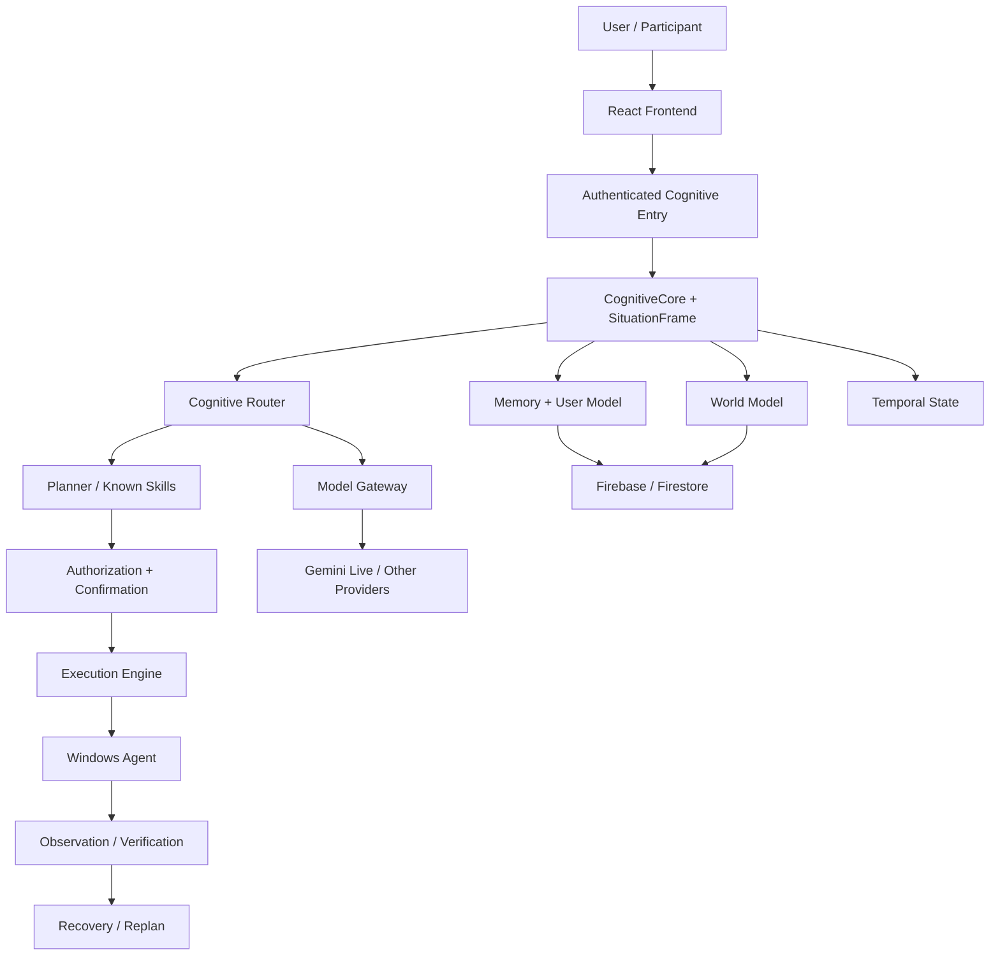

# LOHZ

LOHZ is a personal AI assistant platform combining conversational AI, persistent memory, computer interaction, planning, verification, and a safety-oriented cognitive architecture. It is an engineering and research project—not a claim of AGI or consciousness.

## Features

- Authenticated cognitive entry with Firebase Authentication and UID-scoped state.
- Text and Gemini Live voice conversations with bounded transcripts and interruption handling.
- Working, episodic, semantic, and procedural memory surfaces with local and Firestore persistence.
- A provenance-aware World Model for verified external-state assertions.
- User modeling, temporal context, goals, planning, execution, observation, verification, and recovery.
- Windows Agent tools protected by loopback transport, token authentication, allowlists, risk checks, and filesystem boundaries.
- Multi-person conversation context that keeps participant statements separate from primary-user memory.
- Health/self-model telemetry, experience reflection, skill proposals, adaptive routing, durable task sessions, and controlled code-change proposals.
- Self-maintenance diagnostics with bounded repository inspection, fixed-sandbox verification, health comparison, approval, history, and rollback policy.
- Curiosity/research modules are bounded and do not bypass authorization.

## Architecture



The CognitiveCore coordinates context and truthfulness checks; it does not execute tools or replace the existing router, planner, execution, or observation authorities.

## Security

Authentication is fail-closed in production. Firebase-verified UIDs are the ownership boundary for memory, goals, plans, sessions, learning, health, and code proposals. Tool execution passes through a single authorization/risk boundary with confirmation and verification. The Windows Agent accepts loopback, token-authenticated requests and uses a constrained tool registry and filesystem roots. Retrieved memory, participant content, model output, and research text are treated as untrusted data. Credentials are encrypted at rest by the credential store and are never committed.

See [SECURITY.md](SECURITY.md) and [docs/SECURITY.md](docs/SECURITY.md).

Self-maintenance diagnostics, bounded repository inspection, fixed-sandbox validation, approval, and rollback policy are documented in [docs/SELF_MAINTENANCE.md](docs/SELF_MAINTENANCE.md).

## Memory architecture

- Working memory: bounded, current-request context.
- Episodic memory: timestamped conversation and execution experiences.
- Semantic memory: durable user-scoped facts and preferences with provenance.
- Procedural memory: versioned lessons/skills derived from verified experience.
- World Model: external environment assertions, separate from user identity and preferences.

All durable records are user-scoped, timestamped, provenance-aware, confidence-aware, and retained as data rather than instructions.

## Technology stack

React 19, TypeScript 5.8, Vite 6, Tailwind CSS 4, Express 4, WebSocket (`ws`), Firebase client/Admin SDKs, Firestore rules/emulator, Google GenAI SDK, Vitest, Playwright, esbuild, and optional Electron/electron-builder packaging metadata.

## Project structure

```text
src/             React UI and cognitive/domain services
server.ts        Authenticated Express/WebSocket server
server/          API route wiring and safety gates
windows-agent/   Loopback Windows tool process
desktop/         Electron lifecycle, data, and update policy
scripts/         Build, emulator, benchmark, and release checks
docs/            Architecture, phase, security, and audit records
firestore.rules  Firestore ownership rules
```

## Installation and development

Prerequisite: Node.js 20+ and npm.

```bash
npm install
Copy-Item .env.example .env
npm run dev
```

Production web/server build:

```bash
npm run build
npm start
```

Desktop process bundles are configured with `npm run build:desktop`; packaging targets are available through `npm run package:win`, `npm run package:linux`, and `npm run package:mac`. Native installer, signing, and permission validation remain release work.

## Environment configuration

Use [.env.example](.env.example) as the template. It contains placeholders only. Configure Gemini/provider access, Firebase web settings, the Firebase Admin service-account path, explicit local development auth (only when needed), credential-admin UIDs, and proxy policy. Never put real credentials in Git.

## Firebase setup

The server uses Firebase Admin verification when configured and fails closed when production credentials are absent. Firestore rules are in [firestore.rules](firestore.rules); emulator tests use `npm run test:firestore`.

## Windows Agent

Run `npm run agent` on Windows. The agent listens on loopback, authenticates with a generated or supplied token, and exposes only registered tools. The main server connects through `agentBridge.ts`. When the agent or platform is unavailable, capabilities report degradation and actions do not silently succeed.

## Testing

The historical baseline records **85 test files / 1,061 tests**, but the current full `npm test` run did not complete and is not claimed as passing. Current release gates include `npm run lint`, `npm run build`, Firestore emulator validation (**13/13**), and focused release/security tests (**17/17**).

```bash
npm test -- --pool=forks --maxWorkers=1
npm run lint
npm run build
npm run test:firestore
```

## Desktop status

Native Windows, Ubuntu, and macOS runner builds produce release-candidate artifacts. Signed distribution and interactive install, upgrade, permission, audio, authentication, and notarization tests are not yet evidenced.

## Roadmap and architecture status

- **LIVE:** authenticated cognitive entry, memory/world model, planning/execution/observation, Windows Agent safety, health, self-maintenance diagnostics, and regression tests.
- **PARTIAL:** durable long-horizon execution, learning/skills, adaptive routing, controlled patch promotion, desktop packaging.
- **DORMANT/LEGACY:** compatibility loops, fallback stores, and the fail-closed `local-agent.js` stub.
- **PLANNED:** signed multi-platform release, native installer QA, and further research evaluation.

## Research direction

LOHZ explores grounded memory, world models, self-evaluation, skill acquisition, safe autonomy, and long-horizon agents. These are bounded engineering experiments; the project does not claim consciousness, AGI, or unrestricted self-improvement.

## Contributing

Read [docs/DEVELOPMENT.md](docs/DEVELOPMENT.md), preserve user isolation and fail-closed safety behavior, add regression tests for fixes, and report the exact commands and results you ran. Do not commit `.env`, credentials, local data, generated bundles, or service-account files.

## Security disclosure

Do not publish exploit details or credentials in issues. For a suspected vulnerability, contact the project owner privately through the repository owner’s established channel and include reproduction steps, affected version, and impact. No dedicated security email address is currently declared.

## License

No license file is currently present. Licensing is an owner decision and should be made before public redistribution.
