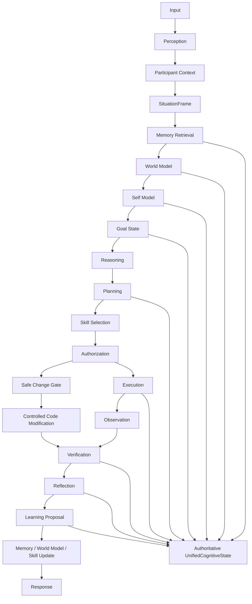

# LOHZ Phase 46 Architecture — Unified Cognitive Operating System

## Objective

Unify the following capabilities into a single authoritative operating model:

- perception
- conversation
- participant awareness
- memory
- World Model
- self-model
- planning
- skills
- execution
- observation
- reflection
- learning
- health
- autonomous tasks
- safe code modification

This is an architecture and integration design, not an AGI declaration and not a bypass of the production safeguards.

---

## 1. Authority model

### Single-authority requirement

LOHZ must operate around one primary decision authority:

```text
Unified Cognitive Orchestrator
  -> owns the lifecycle state
  -> routes evidence to subsystems
  -> resolves conflicts
  -> records outcome and uncertainty
  -> gates execution and learning
```

### Rule: no second authority

No subsystem may become the silent final authority on:

- intent;
- memory truth;
- plan validity;
- skill choice;
- execution permission;
- observation result;
- learned state;
- safe code change decisions.

Subsystems may contribute signals, but the authoritative state remains the orchestrated cognitive state.

---

## 2. Reference architecture



---

## 3. Unified cognitive state

The cognitive state is bounded and reference-based. It should not hold unlimited data in a single object. Instead, it stores references and compact summaries.

```ts
interface UnifiedCognitiveState {
  stateId: string;
  timestamp: string;
  status: "SUCCESS" | "FAILED" | "UNCERTAIN" | "NEEDS_USER" | "BLOCKED";

  request: RequestContextRef;
  participants: ParticipantContextRef[];
  user: UserContextRef | null;
  situation: SituationFrameRef;

  relevantMemories: MemoryRef[];
  worldAssertions: WorldAssertionRef[];
  goals: GoalRef[];
  selfCapabilities: SelfCapabilityRef[];

  selectedSkill: SkillRef | null;
  plan: PlanRef | null;
  execution: ExecutionRef | null;
  observations: ObservationRef[];

  uncertainty: UncertaintyRef[];
  outcome: OutcomeRef | null;
}
```

### Purpose of boundedness

This object stores pointers and compact summaries rather than large free-form payloads. The authoritative state should remain inspectable, serializable, and auditable.

### References and their role

- `RequestContextRef` — input, intent, and scope; not the raw full transcript.
- `ParticipantContextRef` — identities and roles; references to participant profiles.
- `SituationFrameRef` — current task environment, constraints, time, and channel context.
- `MemoryRef` — memory excerpts chosen by retrieval policy.
- `WorldAssertionRef` — accepted state facts and assumptions.
- `GoalRef` — active goals and priorities.
- `SelfCapabilityRef` — available capabilities and explicit limits.
- `SkillRef` — selected or candidate skill with scope and allowed effect.
- `PlanRef` — plan skeleton, steps, dependencies, and guard conditions.
- `ExecutionRef` — the active action record or task record.
- `ObservationRef` — what was observed after execution.
- `UncertaintyRef` — missing evidence, ambiguity, or confidence degradation.
- `OutcomeRef` — final result and status summary.

---

## 4. Stage responsibilities

### 4.1 Perception

Captures raw signals from human input, voice, desktop observation, logs, conversation history, and environment state.

Responsible for:

- normalization;
- signal filtering;
- triage of urgency and channel choice;
- initial classification of user request and context.

### 4.2 Participant Context

Builds the participant model:

- user identity;
- active conversants;
- roles and authority;
- relationship context;
- conversation ownership and turn-taking state.

This is not a second memory system. It is a bounded context layer.

### 4.3 SituationFrame

The `SituationFrame` is the current task-lens object.

It captures:

- active task or conversation state;
- environment context;
- resource constraints;
- current safety posture;
- task type and expected outcome.

The `SituationFrame` should be compact and explicit, with references to deeper context rather than raw dumps.

### 4.4 Memory Retrieval

Retrieves only relevant memory evidence.

Rules:

- relevance before volume;
- no unbounded memory injection;
- evidence must be traceable to source or retrieval event;
- stale or contradictory memories must carry uncertainty metadata.

### 4.5 World Model

The world model holds state assertions and expected transitions.

It answers:

- what is known;
- what is assumed;
- what changed;
- what the next expected state likely is.

It must be updateable by observation and correction, not just by initial assumptions.

### 4.6 Self Model

The self model defines the system's actual capability envelope:

- what it can do;
- what it cannot safely do;
- which skills are allowed;
- what is blocked by policy or environment;
- what it knows it does not know.

This is a bounded capability model, not an unlimited autonomy claim.

### 4.7 Goal State

The goal state tracks:

- highest-priority tasks;
- subgoals and dependencies;
- user intent versus system suggestions;
- urgency and expected success conditions.

### 4.8 Reasoning

Reasoning uses the current state, relevant memory, world assertions, and goal structure to infer the best next step.

This phase should produce a reasoning trace grounded in available evidence and explicit uncertainty.

### 4.9 Planning

Planning converts reasoning into a concrete action plan.

The plan should include:

- steps;
- dependencies;
- fallback paths;
- stopping conditions;
- authorization gates.

### 4.10 Skill Selection

Skill selection chooses the appropriate procedural capability.

Rules:

- skill choice must be traceable to the current task and constraints;
- scope must be limited to allowed abilities;
- risky or unsafe skills require explicit authorization.

### 4.11 Authorization

Authorization is a fail-closed gate.

It asks:

- is the action permitted in this context?
- does it exceed system authority or user authority?
- is the action within the active capability envelope?
- does it require user confirmation or policy review?

### 4.12 Execution

Execution runs the selected plan or skill.

It records:

- action type;
- target;
- actor;
- time;
- result summary;
- expected outcome.

### 4.13 Observation

Observation is external verification of the execution result.

It captures:

- what happened;
- what changed;
- what remains unresolved;
- whether the expected outcome is confirmed or contradicted.

### 4.14 Verification

Verification checks the observed result against the intended outcome.

It may return:

- `SUCCESS`
- `FAILED`
- `UNCERTAIN`
- `NEEDS_USER`
- `BLOCKED`

This decision is not automatically converted into success on weak evidence.

### 4.15 Reflection

Reflection asks: did the pipeline behave as expected?

It reviews:

- mismatch between expectation and outcome;
- uncertainty growth;
- skill fit;
- memory usefulness;
- model accuracy and confidence quality.

### 4.16 Learning Proposal

The learning proposal contains a bounded update recommendation.

It may propose:

- memory refinement;
- world-model correction;
- skill improvement;
- planning or policy update;
- self-model adjustment.

Learning proposals never directly mutate production behavior without the safe change pipeline.

### 4.17 Memory / World Model / Skill Update

This is the update boundary where new evidence is recorded, but only through the controlled mechanisms of the project.

No subsystem is allowed to short-circuit these updates.

### 4.18 Response

The final stage produces the user-facing answer or action summary, grounded in verified state and explicit uncertainty.

---

## 5. Failure semantics

A stage must not equate uncertainty with success.

```text
if result == UNCERTAIN:
  halt or request more evidence
if result == NEEDS_USER:
  request confirmation or delegation
if result == BLOCKED:
  identify definite constraint and stop
if result == FAILED:
  diagnose and recover or escalate
if result == SUCCESS:
  only after verification and evidence match
```

The system must reason in terms of evidence quality, not confidence theater.

---

## 6. Safe code modification integration

Phase 46 includes safe code modification as a bounded subsystem, not as an autonomous authority.

The proper flow is:

```text
Problem or requested repair
 -> diagnosis under bounded policy
 -> proposal object with exact patch evidence
 -> verification in sandbox or controlled environment
 -> approval gate
 -> explicit apply step
 -> replayed validation
 -> audit log
```

The code-change path does not alter the live runtime unless the existing safe change pipeline approves it.

---

## 7. Architectural invariants

The following invariants define the unified operating system:

1. One authoritative state object.
2. One lifecycle pipeline.
3. No hidden second authority.
4. Uncertainty is explicit and actionable.
5. Verification is required before success claims.
6. Memory, world model, and skills update through traceable evidence.
7. Autonomous tasks operate under bounded gates.
8. Safe code modification remains a controlled, reviewable process.

---

## 8. Operational summary

The architecture creates a stable loop:

```text
Perceive -> frame -> retrieve -> model -> decide -> plan -> select skill -> authorize -> act -> observe -> verify -> reflect -> learn -> update -> respond
```

The system remains bounded, evidence-driven, and audit-friendly. It does not rely on vague general intelligence claims; it relies on explicit state transitions, failure handling, and safe boundaries.
